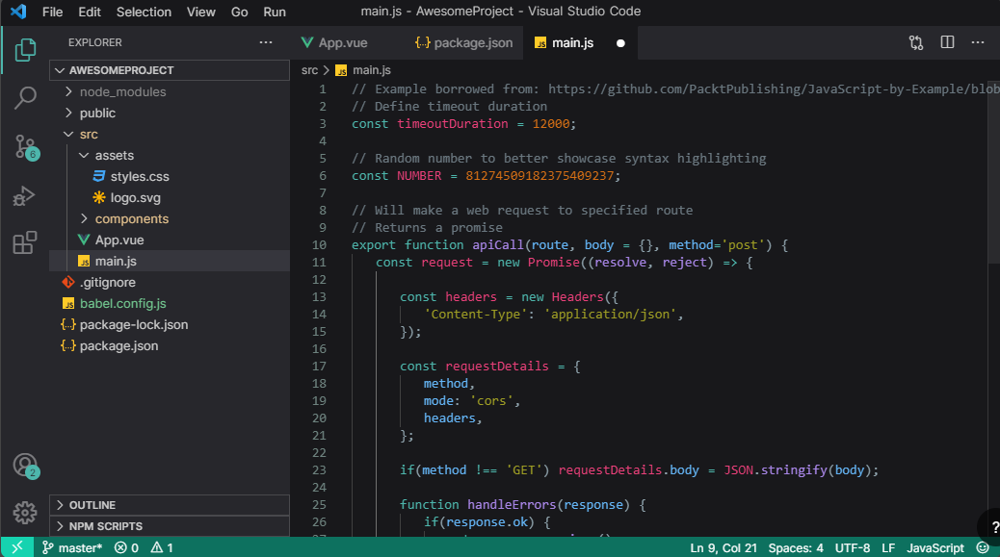

# Glitch Theme 👾

_Are you tired of thoose blue/purple themes with dark backgrounds?_
Great! because here's a green/crimson theme with dark background!

### How to start using it? 🤔

1. File > Preferences > Extensions or `CMD + Shift + X`
2. Search Glitch and install it
3. `CMD + Shift + P` > `color theme` then choose Glitch

## Hope you enjoy the theme!🐴
