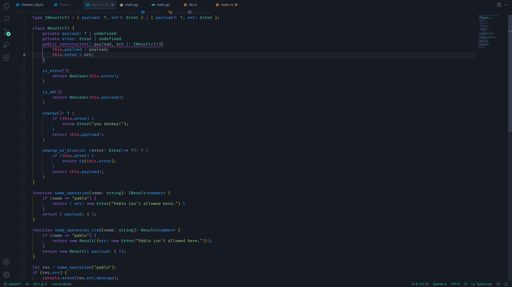
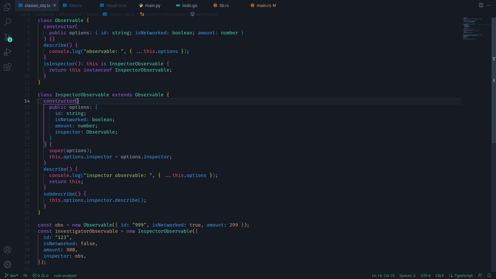
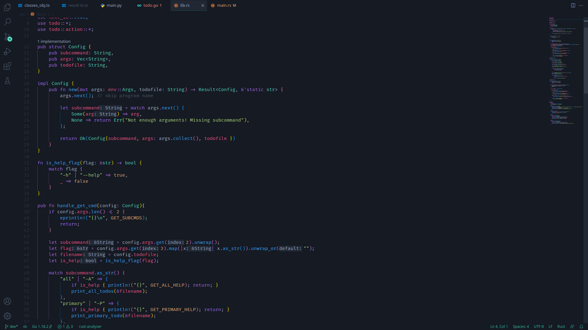

    
    <h1>Glitch Theme</h1>
    <h4>Don't be scared of bugs. Embrace the bug. Become the bug ⚡️🐛</h4>

### How to Install? 🤔
1. File > Preferences > Extensions or `CMD + Shift + X`
2. Search Glitch and click the install button
3. `CMD + Shift + P` > `color theme` then choose `Glitch`

### Credits
Inspired by:
- [Vscode dark+](https://github.com/microsoft/vscode/tree/main/extensions/theme-defaults/themes)
- [The Best Theme](https://github.com/jankohlbach/the-best-theme)
- [Palenight Theme](https://github.com/whizkydee/vscode-palenight-theme)

